# Práctica del tema 3 de 1ºDAM

Autores:
- Gil Vacas
- José Ángel Soriano

# Manual de Usuario - FernanPaaq versión 1.0
## Índice
1. [Introducción](#1-introducción)
2. [Instalación](#2-instalación)
3. [Menú principal](#3-menú-principal)
   
    3.1 [Iniciar sesión](31-iniciar-sesión)
   
        3.1.1 [Menú de administrador](311-menú-de-administrador)
   
           a.[Registrar un nuevo envío](a-registrar-un-nuevo-envío)
   
           b.[Asignar un envío a un conductor](b-asignar-un-envío-a-un-conductor)
   
		       c.[Ver los datos de todos los destinatarios](c-ver-los-datos-de-todos-los-destinatarios)
   
		       d.[Ver los datos de todos los envíos](d-ver-los-datos-de-todos-los-envíos)
   
		       e.[Ver los datos de todos los conductores](e-ver-los-datos-de-todos-los-conductores)
   
		       f.[Modificar mi perfil](f-modificar-mi-perfil)
   
		       g.[Cerrar sesión](g-cerrar-sesión)
   
     
   3.1.2 [Menú de destinatario](312-menú-de-destinatario)
    
           a.[Seguir mis envíos](a-seguir-mis-envíos)
   
           b.[Modificar mis datos de entrega para un envío](b-modificar-mis-datos-de-entrega-para-un-envío)
   
		       c.[Ver mi perfil](c-ver-mi-perfil)
   
		       d.[Modificar mi perfil](d-modificar-mi-perfil)
   
		       e.[Cerrar sesión](e-cerrar-sesión)
   
   3.1.3 [Menú de conductor](313-menú-de-conductor)
   
           a.[Ver la información de mis envíos](a-ver-la-información-de-mis-envíos)
   
           b.[Cambiar el estado de un envío](b-cambiar-el-estado-de-un-envío)
   
		       c.[Ver el histórico de paquetes entregados](c-ver-el-histórico-de-paquetes-entregados)
   
		       d.[Modificar mi perfil](d-modificar-mi-perfil)
   
		       e.[Cerrar sesión](e-cerrar-sesión)
   3.2 [Registar nuevo usuario](32-registrar-nuevo-usuario)
   
   3.3 [Cerrar el programa](33-cerrar-el-programa)

## 1. Introducción
Bienvenido al manual de usuario de la primera versión de FernanPaaq, un software que busca la total gestión de una empresa de paquetería. A lo largo de este manual se detallarán todas las características que esta versión de nuestro software posee.
Para agilizar la navegación, se ha limitado el número de usuarios y envios que pueden crearse en el programa. Además se han insertado datos de prueba de tres usuarios, uno de cada tipo:

          -	Administrador: email -> carlosbarroso@test.com  //  Contraseña -> admin
          
          -	Destinatario: email -> peplopez@test.com  //  Contraseña -> 1234
          
          -	Conductor: email -> martamartinez@test.com  //  Contraseña -> 5678

## 2. Instalación
Para la instalación es necesario descargar los archivos adjuntos a este manual.
Una vez descargados y descomprimidos, accederemos a la carpeta “fernanpaaq” y haremos click en el ejecutable “ejecutarPrograma.bat”.

## 3. Menú principal
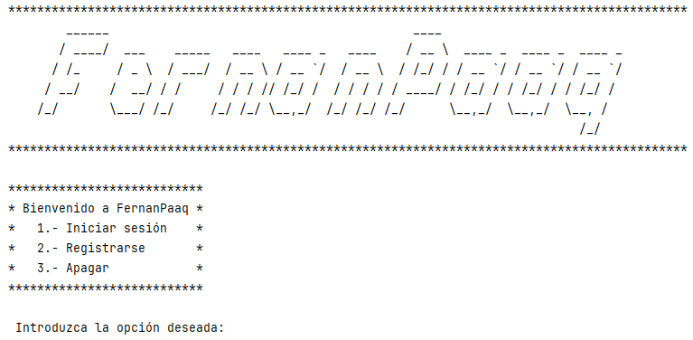

### 3.1 Iniciar sesión
Para iniciar sesión es necesario estar registrado e introducir el email y contraseña correspondientes. Se disponen de 3 oportunidades antes de volver al menú principal.

#### 3.1.1 Menú de administrador
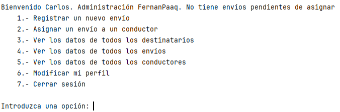

##### a. Registrar un nuevo envío
En este software, el administrador debe registrar los envíos para destinatarios. Se muestra un listado de los destinatarios a los que aún se les puede asignar envíos, incluso puede registrar un nuevo destinatario si es necesario. Si un conductor reparte en la misma provincia en la que vive el destinatario, el envío se le asignará automáticamente a dicho conductor.

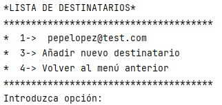

##### b. Asignar un envío a un conductor
Si existen envíos que no han podido ser asignados automáticamente (en el menú de administrador, se muestra un contador de cuántos envíos no han sido aún asignados), estos podrán ser seleccionados y asignados a un conductor que esté disponible.

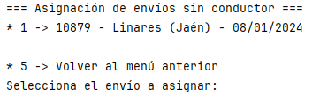

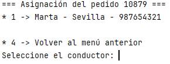

##### c. Ver los datos de todos los destinatarios
Muestra los datos de todos los destinatarios registrados.

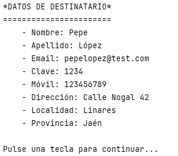

##### d. Ver los datos de todos los envíos
Muestra los datos de todos los envíos creados.

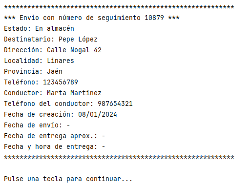

##### e. Ver los datos de todos los conductores
Muestra los datos de todos los conductores registrados.

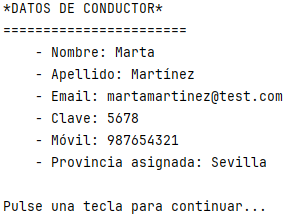

##### f. Modificar mi perfil
Muestra los datos del administrador y una serie de parámetros modificables.

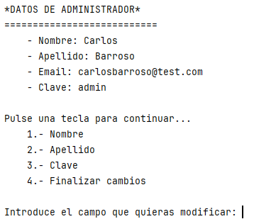

##### g. Cerrar sesión
Cierra la sesión y vuelve al menú principal

#### 3.1.1 Menú de destinatario
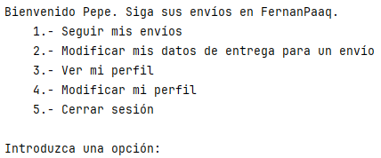

##### a. Seguir mis envíos
Se muestra un listado de los envíos registrados para dicho destinatario.

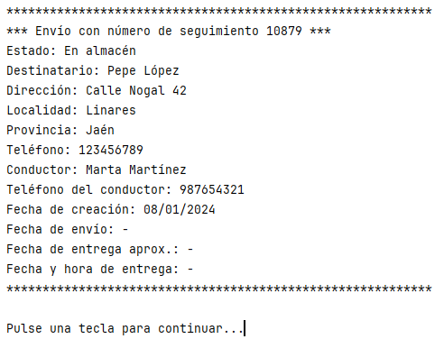

##### b. Modificar mis datos de entrega para un envío
Se muestra un listado de los envíos registrados para dicho destinatario para modificar parámetros como la dirección.

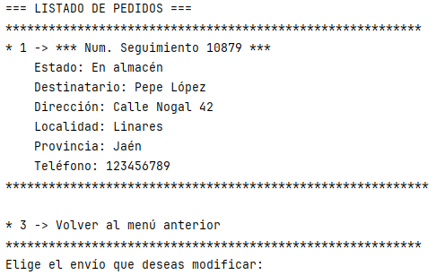

##### c. Ver mi perfil
Muestra los datos del destinatario.

##### d. Modificar mi perfil
Muestra los datos del destinatario y una serie de parámetros modificables.

##### e. Cerrar sesión
Cierra la sesión y vuelve al menú principal

#### 3.1.1 Menú de conductor
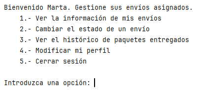

##### a. Ver la información de mis envíos
Se muestra un listado de los envíos asignados al conductor.

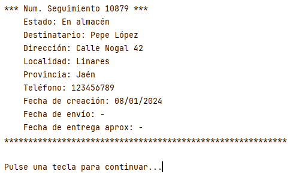

##### b. Cambiar el estado de un envío
Se muestra un listado de los envíos asignados con el fin de actualizar el estado en el que se encuentra dicho pedido.

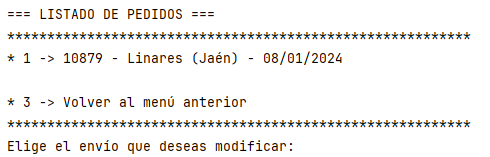
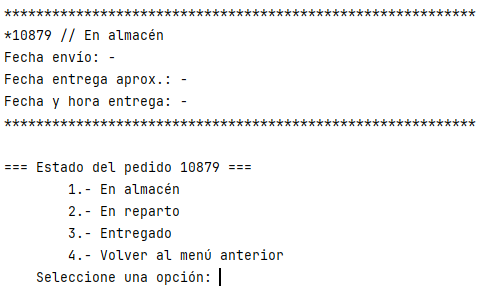

- Si se actualiza a "En reparto", la fecha de envío toma el valor de la fecha actual y posteriormente se pide una cantidad de días para calcular una fecha de entrega aproximada
  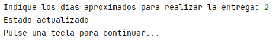

- Si se actualiza a "Entregado", se pide el día y mes por teclado para establecer la fecha en la que se entregó finalmente el pedido. Una vez llegado a este estado, no podrá volver a actualizarse.
  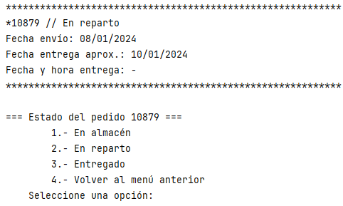
  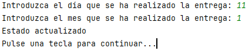

  
##### c. Ver el histórico de paquetes entregados
Al haber realizado alguna entrega, se mostrarán dichos pedidos con los datos completos.

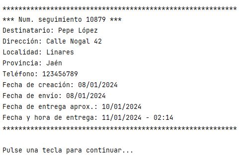

##### d. Modificar mi perfil
Muestra los datos del conductor y una serie de parámetros modificables.

##### e. Cerrar sesión
Cierra la sesión y vuelve al menú principal

### 3.2 Registrar nuevo usuario
Permite registrarse un nuevo usuario, tanto destinatario como conductor. Como se ha mencionado anteriormente, en esta versión el número es limitado (2 destinatarios y 3 conductores).
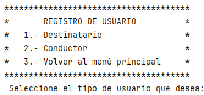

### 3.3 Cerrar el programa
Finaliza y cierra el software.
